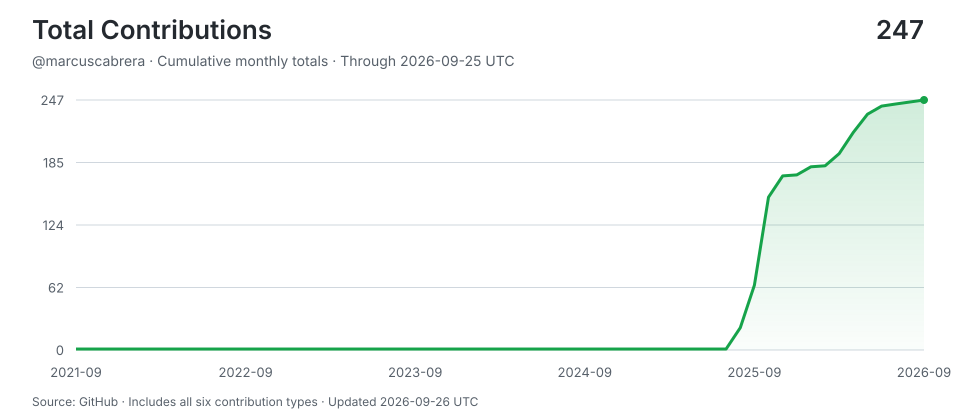

# Marcus Cabrera

> Shipping with AI agents around the clock -- human hours for thinking, machine hours for doing.
>
> Stats auto-updated by [aidevops](https://aidevops.sh).

<!-- STATS-START -->
## Work with AI

| Metric | Yesterday | Prior 7 Days | Prior 28 Days | Prior 365 Days |
| --- | ---: | ---: | ---: | ---: |
| Screen time (Linux) | 15.6h | 155.9h | 397.3h | ~7632h* |
| Interactive human attention | 0.1h | 0.1h | 0.1h | 0.1h |
| Interactive AI generation | 0.1h | 0.1h | 0.1h | 0.1h |
| Worker-classified human attention | 0.0h | 0.0h | 0.0h | 0.0h |
| Worker/headless AI generation | 0.0h | 0.0h | 0.0h | 0.0h |
| Additive observed work | 0.2h | 0.2h | 0.2h | 0.2h |
| Interactive sessions | 3 | 3 | 7 | 7 |
| Worker sessions | 0 | 0 | 0 | 0 |

_Screen time from linux-systemd-logind:session-lid-lock-state; collection status: ok. *365-day estimate uses observed calendar coverage._

_Periods are completed local calendar days ending at midnight; today is excluded._

_Human attention is unioned wall-clock time, so overlapping sessions are not double-counted. AI generation is additive machine work across sessions; it is not wall-clock concurrency._

_AI session 365-day totals cover 16 days of local assistant session history (not extrapolated)._

## AI Model Usage (all time)

| Model | Requests | Input | Output | Cache read | Cache Hit-Rate % | Session Count | Session Hours |
| --- | ---: | ---: | ---: | ---: | ---: | ---: | ---: |
| nemotron-3-ultra-free | 17 | 855K | 3K | 2.1M | 71.1% | 3 | 0.2h |
| big-pickle | 15 | 441K | 3K | 1.2M | 74.1% | 2 | 0.0h |
| cmc/deepseek/deepseek-v4-flash | 2 | 257K | 173 | 0 | 0.0% | 1 | 0.0h |
| gc/gemini-3-pro-preview | 1 | 0 | 0 | 0 | 0.0% | 1 | — |
| copilot | 1 | 0 | 0 | 0 | 0.0% | 1 | 0.0h |
| **Total** | **36** | **1.5M** | **7K** | **3.3M** | **68.5%** | **7** | **—** |

_4.9M total tokens processed. 68.5% cache hit rate._
<!-- STATS-END -->

## Projects

- **[mywiki](https://github.com/marcuscabrera/mywiki)** -- No description
- **[ansible-container-runtime](https://github.com/marcuscabrera/ansible-container-runtime)** -- ansible-container-runtime
- **[mvc-OpenSRE](https://github.com/marcuscabrera/mvc-OpenSRE)** -- No description
- **[multicloudstack](https://github.com/marcuscabrera/multicloudstack)** -- No description
- **[rfp-open-work](https://github.com/marcuscabrera/rfp-open-work)** -- No description
- **[full-stack-agent](https://github.com/marcuscabrera/full-stack-agent)** -- No description
- **[CursoGoogleADK](https://github.com/marcuscabrera/CursoGoogleADK)** -- Desenvolvendo Agentes de IA com Google ADK e Gemini 3 Pro
- **[DomiBot](https://github.com/marcuscabrera/DomiBot)** -- Asistente Virtual para Pedidos y Reservas en Restaurantes
<!-- CONTRIBUTIONS-START -->
## Contributions

- **[2024-08-27-n8n-whatsapp](https://github.com/Cafe-Tech-BR/2024-08-27-n8n-whatsapp)** -- Assistente virtual utilizando n8n com WhatsApp, Redis e OpenAI; OpenWebUI; Anthropic.
- **[500-AI-Agents-Projects](https://github.com/ashishpatel26/500-AI-Agents-Projects)** -- The 500 AI Agents Projects is a curated collection of AI agent use cases across various industries. It showcases practical applications and provides links to open-source projects for implementation, illustrating how AI agents are transforming sectors such as healthcare, finance, education, retail, and more.
- **[90DaysOfDevOps](https://github.com/MichaelCade/90DaysOfDevOps)** -- This repository started out as a learning in public project for myself and has now become a structured learning map for many in the community. We have 3 years under our belt covering all things DevOps, including Principles, Processes, Tooling and Use Cases surrounding this vast topic. 
- **[Acai-Delivery-Chatbot](https://github.com/tonysilva22/Acai-Delivery-Chatbot)** -- O Acai-Delivery-Chatbot é uma solução automatizada desenvolvida para otimizar o atendimento ao cliente e o processo de entrega de uma loja de Açaí. Ele permite que os clientes façam pedidos, escolham complementos e forneçam informações necessárias para entrega ou retirada no local.
- **[agent-for-rfp-response-solution-accelerator](https://github.com/microsoft/agent-for-rfp-response-solution-accelerator)** -- agent-for-rfp-response-solution-accelerator
- **[agentic-handson](https://github.com/ed-donner/agentic)** -- Hands-on LLM Engineering including Agentic AI Project
- **[agenticSeek](https://github.com/Fosowl/agenticSeek)** -- Fully Local Manus AI. No APIs, No $200 monthly bills. Enjoy an autonomous agent that thinks, browses the web, and code for the sole cost of electricity. 🔔 Official updates only via twitter @Martin993886460 Beware of fake account
- **[agents-curse](https://github.com/ed-donner/agents)** -- Repo for the Complete Agentic AI Engineering Course
- **[agents.md](https://github.com/agentsmd/agents.md)** -- AGENTS.md — a simple, open format for guiding coding agents
- **[Agents-Prompts](https://github.com/rtadewald/Agents-Prompts)** -- No description
- **[aiac](https://github.com/gofireflyio/aiac)** -- Artificial Intelligence Infrastructure-as-Code Generator.
- **[ai-chatbot](https://github.com/rryyqn/ai-chatbot)** -- A customizable AI support chatbot template with Arcjet rate limiting and bot protection. Made completely free with Google AI Studio
- **[ai-engineering-hub](https://github.com/patchy631/ai-engineering-hub)** -- In-depth tutorials on LLMs, RAGs and real-world AI agent applications.
- **[allinssl](https://github.com/allinssl/allinssl)** -- AllinSSL 是一个集证书申请、管理、部署和监控于一体的SSL证书全生命周期管理工具。AllinSSL is an all-in-one SSL certificate lifecycle management tool that integrates certificate application, management, deployment, and monitoring. 
- **[ansible-aisnippet](https://github.com/stephrobert/ansible-aisnippet)** -- Generate ansible tasks with AI
- **[ansible-django-stack](https://github.com/YPCrumble/ansible-django-stack)** -- Ansible Playbook for setting up a Django app with Nginx, Gunicorn, PostgreSQL, Celery, RabbitMQ, Supervisor, Virtualenv, and Memcached. A Vagrantfile for provisioning a VirtualBox virtual machine is included as well.
- **[ansible-for-devops](https://github.com/geerlingguy/ansible-for-devops)** -- Ansible for DevOps examples.
- **[ansible-windows-failover-cluster](https://github.com/oatakan/ansible-windows-failover-cluster)** -- Ansible playbooks to create a failover windows cluster
- **[ansible-win](https://github.com/T466/ansible)** -- Repositório de playbooks
- **[AppFlowy](https://github.com/AppFlowy-IO/AppFlowy)** -- Bring projects, wikis, and teams together with AI. AppFlowy is the AI collaborative workspace where you achieve more without losing control of your data. The leading open source Notion alternative.
- **[AstrBot](https://github.com/AstrBotDevs/AstrBot)** -- ✨ 一站式 LLM 聊天机器人平台及开发框架 ✨ 支持 QQ、QQ频道、Telegram、企微、飞书、钉钉 | 知识库、MCP 服务器、OpenAI、DeepSeek、Gemini、硅基流动、月之暗面、Ollama、OneAPI、Dify
- **[atendechat2024](https://github.com/lopespkm/atendechat2024)** -- No description
- **[atendechat8](https://github.com/marionumza/atendechat8)** -- No description
- **[atendechat-fork](https://github.com/thomashebertonribeiro/atendechat)** -- Fork of atendechat
- **[atendechatinstall](https://github.com/lopespkm/atendechatinstall)** -- No description
- **[auto-rfp](https://github.com/run-llama/auto_rfp)** -- auto-rfp
- **[awesome-ai-apps](https://github.com/Arindam200/awesome-ai-apps)** -- A collection of projects showcasing RAG, agents, workflows, and other AI use cases
- **[awesome-llm-apps](https://github.com/Shubhamsaboo/awesome-llm-apps)** -- Collection of awesome LLM apps with AI Agents and RAG using OpenAI, Anthropic, Gemini and opensource models.
- **[awesome-n8n-templates](https://github.com/enescingoz/awesome-n8n-templates)** -- Supercharge your workflow automation with this curated collection of n8n templates! Instantly connect your favorite apps-like Gmail, Telegram, Google Drive, Slack, and more-with ready-to-use, AI-powered automations. Save time, boost productivity, and unlock the true potential of n8n in just a few clicks.
- **[awesome-sre](https://github.com/dastergon/awesome-sre)** -- A curated list of Site Reliability and Production Engineering resources.
- **[botIA-Whatsapp-NodeJs](https://github.com/MACHADOKING/botIA-Whatsapp-NodeJs)** -- Bot para pedidos online via whatsapp - Nodejs
- **[botpress](https://github.com/botpress/botpress)** -- The open-source hub to build & deploy GPT/LLM Agents ⚡️
- **[botwhatsapp-venom](https://github.com/juniorwmr/botwhatsapp-venom)** -- Projeto criado com o intuito de auxiliar nas demandas de pedidos da empresa "Delícias da Neide" via WhatsApp.
- **[BrowserOS](https://github.com/browseros-ai/BrowserOS)** -- 🌐 The open-source Agentic browser; alternative to ChatGPT Atlas, Perplexity Comet, Dia.
- **[builderbot](https://github.com/codigoencasa/builderbot)** -- 🤖 Crear Chatbot WhatsApp en minutos. Únete a este proyecto OpenSource
- **[catalogo-digital-whatsapp](https://github.com/MatheusGatti/catalogo-digital-whatsapp)** -- Catálogo digital com pedidos via WhatsApp.
- **[Chatbot-de-WhatsApp-multiusu-rio](https://github.com/adrielscamargos/Chatbot-de-WhatsApp-multiusu-rio)** -- Projeto pessoal de implementação de CRM multiusuário com Chatbot de WhatsApp em nuvem utilizando sistemas open source, como IZING, WHaticket, VENOMBOT com Vps da Amazon AWS Contaboo e Hostinger, utilizando maquina Linux e Windows pura e containers docker. utilizando configuração e instalação e personalização do front end back end do sistemas do 0,
- **[chatia](https://github.com/JefferDevop/chatia)** -- Chat con inteligenica artificial
- **[chatwoot-all-in-one](https://github.com/edcarlosm/chatwoot-all-in-one)** -- Chatwoot n8n wppconnect botpress bridge-bot
- **[CL4R1T4S-Sys-Prompts](https://github.com/elder-plinius/CL4R1T4S)** -- LEAKED SYSTEM PROMPTS FOR CHATGPT, GEMINI, GROK, CLAUDE, PERPLEXITY, CURSOR, DEVIN, REPLIT, AND MORE! - AI SYSTEMS TRANSPARENCY FOR ALL! 👐
- **[Cloud-Free-Tier-Comparison](https://github.com/cloudcommunity/Cloud-Free-Tier-Comparison)** -- Comparing the free tier offers of the major cloud providers like AWS, Azure, GCP, Oracle etc.
- **[cmdb](https://github.com/veops/cmdb)** -- CMDB: configuration and management of IT resources
- **[confluence-markdown-exporter](https://github.com/Spenhouet/confluence-markdown-exporter)** -- Export Atlassian Confluence pages as markdown files.
- **[Confluence-Space-Exporter](https://github.com/jc1518/Confluence-Space-Exporter)** -- CLI for exporting Confluence space
- **[copilot-finops](https://github.com/renatoromao/copilotstudio-samples-finops)** -- FinOps agent
- **[CopilotKit](https://github.com/CopilotKit/CopilotKit)** -- React UI + elegant infrastructure for AI Copilots, AI chatbots, and in-app AI agents. The Agentic last-mile 🪁
- **[deepsproxy](https://github.com/pedrofariasx/deepsproxy)** -- No description
- **[devops-exercises](https://github.com/bregman-arie/devops-exercises)** -- Linux, Jenkins, AWS, SRE, Prometheus, Docker, Python, Ansible, Git, Kubernetes, Terraform, OpenStack, SQL, NoSQL, Azure, GCP, DNS, Elastic, Network, Virtualization. DevOps Interview Questions
- **[devops-open-agent](https://github.com/ideaweaver-ai/devops-open-agent)** -- No description
- **[Disparador-de-Campanha-Chatwoot-Evolution](https://github.com/rodtanci/Disparador-de-Campanha-Chatwoot-Evolution)** -- Disparando campanhas direto do ChatWoot com N8N + Evolution API
- **[docker-mailserver](https://github.com/docker-mailserver/docker-mailserver)** -- Production-ready fullstack but simple mail server SMTP, IMAP, LDAP, Antispam, Antivirus, etc. running inside a container.
- **[docker-n8n-evolution](https://github.com/carneiro-fernando/docker-n8n-evolution)** -- Whatsapp bot using LLM
- **[Docker-N8N](https://github.com/Sparo100/Docker)** -- No description
- **[ecosystem-chat](https://github.com/Henrikmatos/ecosystem-chat)** -- Implantação Traefik + Portainer + Postgres + Minio + Redis + Chatwoot + N8N + Evolution API White Label
- **[FreeAiOps](https://github.com/lihaiya/FreeAiOps)** -- 专注在智能运维、自动化运维、Zabbix、Prometheus、Grafana、Nagios、ELK Stack（Elasticsearch、Logstash、Kibana）、Graylog、Ansible、SaltStack、Puppet、Chef、Terraform、Docker、Kubernetes、OpenShift、Jenkins、MySQL、PostgreSQL、MariaDB、Redis、MongoDB、InfluxDB、Ceph、MinIO，RabbitMQ、Kafka、NATS、Apache Pulsar、Nginx、Apache HTTP Server、HAProxy、Traefik、Caddy、OpenStack、OpenLDAP、FreeRDP等多个领域。 
- **[gorestaurant](https://github.com/lucasbarzan/gorestaurant)** -- 🥣 App web/mobile de cardápio para restaurante que permite criar, atualizar e remover pratos, além de fazer pedidos 🍽️
- **[gympoint-fork](https://github.com/Walafi02/gympoint)** -- Plataforma completa para gestão de academias, composta por uma API backend, um painel web frontend para administradores e um app mobile para alunos. O projeto cobre o fluxo de matrícula, planos, check-ins e atendimento de dúvidas dos alunos em um único ecossistema.
- **[highlight-mvc](https://github.com/highlight/highlight)** -- highlight.io: The open source, full-stack monitoring platform. Error monitoring, session replay, logging, distributed tracing, and more.
- **[holmesgpt-mvc](https://github.com/HolmesGPT/holmesgpt)** -- SRE Agent - CNCF Sandbox Project
- **[I2N_plataform-fork](https://github.com/mateusmg319/I2N_plataform)** -- Plataforma nocode / lowcode em desenvolvimento estilo n8n make etc.. 
- **[Integracao-Asaas-n8n-BotConversa](https://github.com/joaogusta260/Integracao-Asaas-n8n-BotConversa)** -- Automação de cobranças, lembretes e confirmações de pagamento usando n8n, Asaas e BotConversa.
- **[ipampy](https://github.com/bensnyde/ipampy)** -- IP Management based on Python's Django Web Framework
- **[KaiClaw](https://github.com/SimonSchubert/Kai)** -- OpenClaw alternative in your pocket
- **[keep-mvc](https://github.com/keephq/keep)** -- The open-source AIOps and alert management platform
- **[learn-generative-ai](https://github.com/panaverse/learn-generative-ai)** -- Learn Cloud Applied Generative AI Engineering GenEng using OpenAI, Gemini, Streamlit, Containers, Serverless, Postgres, LangChain, Pinecone, and Next.js
- **[linux-dash](https://github.com/tariqbuilds/linux-dash)** -- A beautiful web dashboard for Linux
- **[local-ai-stack](https://github.com/j4ys0n/local-ai-stack)** -- Open WebUI, ComfyUI, n8n, LocalAI, LLM Proxy, SearXNG, Qdrant, Postgres all in docker compose
- **[MailpileNG](https://github.com/mailpile/Mailpile)** -- A free & open modern, fast email client with user-friendly encryption and privacy features
- **[mangabaAI](https://github.com/Mangaba-ai/mangaba_ai)** -- Repositório minimalista para criação de agentes de IA inteligentes e versáteis com protocolos A2A Agent-to-Agent e MCP Model Context Protocol.
- **[mcp_extractor_confluence](https://github.com/Mammals-at-work/mcp_extractor_confluence)** -- No description
- **[mimo-ai-proxy](https://github.com/pedrofariasx/mimo-ai-proxy)** -- No description
- **[mvc-code](https://github.com/QwenLM/qwen-code)** -- An open-source AI coding agent that lives in your terminal.
- **[mvc-vibe-kanban](https://github.com/BloopAI/vibe-kanban)** -- Get 10X more out of Claude Code, Codex or any coding agent
- **[n8n-ai-automations](https://github.com/lucaswalter/n8n-ai-automations)** -- Collection of n8n workflows, n8n templates, AI automations, and AI agents created for The Recap AI YouTube channel and the AI Automation Mastery free Skool community.
- **[n8n-automations](https://github.com/MustafaKemal0146/n8n-automations)** -- Ready-to-use n8n automation workflows for business, AI, and productivity. Instantly boost efficiency with 22 templates—no coding needed!
- **[n8n-automation-templates-5000](https://github.com/ritik-prog/n8n-automation-templates-5000)** -- 5000+ real-world, production-ready n8n workflow templates with AI, CRM, finance, e-commerce, marketing, and RAG automation. Free and open source.
- **[n8n-backups](https://github.com/woakes070048/n8n-backups-8)** -- n8n workflow backups
- **[n8n-bulk-automated-google-drive-files-sharing-and-direct-download-link-generation](https://github.com/Automations-Project/n8n-bulk-automated-google-drive-files-sharing-and-direct-download-link-generation)** --  This project is another Nodemation AKA: n8n Free Workflow Template... 
- **[n8n-chatbot-template](https://github.com/WayneSimpson/n8n-chatbot-template)** -- No description
- **[n8n-docker-env](https://github.com/danilopinotti/n8n-docker)** -- A docker-compose environment for a fast n8n production with SSL
- **[n8n-evolution-chat-bot](https://github.com/Carlos-Juatan/n8n-evolution-chat-bot)** -- Arquivos para instalação do n8n evolution
- **[n8n-evo-pg-ngrok](https://github.com/Rafael-Honorato/n8n)** -- n8n - Evolution Api - Postgres Vector - Redis - Ngrok - adminer
- **[n8n-ngrok](https://github.com/Joffcom/n8n-ngrok)** -- No description
- **[n8n-qdrant-ollama-typhoonocr](https://github.com/nolifelover/n8n-qdrant-ollama-typhoonocr)** -- No description
- **[n8n_restaurant-bot](https://github.com/tejas-2744/n8n_restaurant-bot)** -- I have just created restaurant bot for ordering food, developed using n8n workflow and i have connected Google Gemini.
- **[n8n-secure-deployment](https://github.com/telepilotco/n8n-secure-deployment)** -- Secure n8n deployment templates using Caddy and Traefik, with Tailscale for private access and Let's Encrypt for automated SSL. Public webhooks, private admin panel. 🔐
- **[n8n-self-hosted](https://github.com/7PH/n8n-self-hosted)** -- Ready to use containerized self-hosted N8N instance with persistent workflows/credentials, HTTP auth and auto-TLS certificate generation
- **[n8n-ultimate-cheat-sheet](https://github.com/Kookylo/n8n-ultimate-cheat-sheet)** -- N8N cheat sheet 500+ functions and examples with copy-paste ready code examples
- **[n8n-waha-chatwoot](https://github.com/Sudo-psc/n8n-waha-chatwoot)** -- n8n-waha-chatwoot automation VPS
- **[n8n-workflow-builder](https://github.com/makafeli/n8n-workflow-builder)** -- AI assistant integration for n8n workflow automation through Model Context Protocol MCP. Connect Claude Desktop, ChatGPT, and other AI assistants to n8n for natural language workflow management.
- **[N8N-Workflow](https://github.com/BilalMoazzam/N8N-Workflow)** -- Collection of n8n workflow templates WhatsApp bot, AI Agent, Gmail automation, Payroll system, SEO, Weather, etc. to solve real-world problems with automation.
- **[n8n-workflows-1](https://github.com/barnyp/n8n-workflows)** -- My n8n workflows
- **[N8N-Workflows-ai-response](https://github.com/sanglap666/N8N-Workflows)** -- No description
- **[n8n-workflows-codes](https://github.com/durbaezgomez/n8n-workflows)** -- This is a collection of workflows, where I’m exploring and building powerful automations to simplify daily tasks and improve productivity. 
- **[n8n-workflows-devel](https://github.com/architjn/n8n-workflows)** -- No description
- **[n8n-workflows](https://github.com/Zie619/n8n-workflows)** -- all of the workflows of n8n i could find also from the site itself
- **[nautobot](https://github.com/nautobot/nautobot)** -- Network Source of Truth & Network Automation Platform
- **[netbox](https://github.com/netbox-community/netbox)** -- The premier source of truth powering network automation. Open source under Apache 2. Try NetBox Cloud free: https://netboxlabs.com/products/free-netbox-cloud/
- **[netdata-mvc](https://github.com/netdata/netdata)** -- The fastest path to AI-powered full stack observability, even for lean teams.
- **[nginx-ui](https://github.com/0xJacky/nginx-ui)** -- Yet another WebUI for Nginx
- **[ngxtop](https://github.com/lebinh/ngxtop)** -- Real-time metrics for nginx server
- **[oke-free](https://github.com/Rapha-Borges/oke-free)** -- Uma maneira fácil de garantir seu próprio cluster Kubernetes gratuitamente e para sempre
- **[ollamaCPUOnly](https://github.com/alpine-docker/ollama)** -- Minimal CPU-only Ollama Docker Image
- **[OmniRouteNG](https://github.com/diegosouzapw/OmniRoute)** -- Never stop coding. Free AI gateway: one endpoint, 160+ providers 50+ free, connect Claude Code, Codex, Cursor, Cline & Copilot to FREE Claude/GPT/Gemini. RTK+Caveman stacked compression saves 15-95% tokens, smart auto-fallback, MCP/A2A, multimodal APIs, Desktop/PWA.
- **[openai-rfp-response-analyzer](https://github.com/lesteroliver911/openai-rfp-response-analyzer)** -- RFP-Response Analyzer is a Flask web app that uses AI to analyze and compare RFP documents with their responses, providing insights, gap analysis, and interactive chat for quick queries.
- **[openclaw-zero-token-mvc](https://github.com/linuxhsj/openclaw-zero-token)** -- OpenClaw: Use All Major AI Models NO API Token! Claude/ChatGPT/Gemini/DeepSeek/Doubao/Grok/Qwen/Manus/Kimi
- **[opencost](https://github.com/opencost/opencost)** -- Cost monitoring for Kubernetes workloads and cloud costs
- **[openfang-mvc](https://github.com/RightNow-AI/openfang)** -- Open-source Agent Operating System
- **[OpenHands](https://github.com/OpenHands/OpenHands)** -- 🙌 OpenHands: Code Less, Make More
- **[openmanus-ai](https://github.com/openmanus-ai/openmanus-ai)** -- No description
- **[OpenManusAI](https://github.com/openmanus-ai/OpenManus)** -- No fortress, purely open ground.  OpenManus is Coming.
- **[OpenSRE-mvcA](https://github.com/swapnildahiphale/OpenSRE)** -- Open-source AI SRE agent that investigates production incidents using episodic memory and Neo4j knowledge graph. 46 production skills. Self-hosted.
- **[opensre-mvc](https://github.com/Tracer-Cloud/opensre)** -- Build your own AI SRE agents. The open source toolkit for the AI era ✨ 
- **[ops0-cli](https://github.com/ops0-ai/ops0-cli)** -- ops0 is an AI-powered natural language DevOps CLI native to Claude AI with ansible, terraform, kubernetes, aws, azure and docker operations in a single cli. An open-source alternative to complex DevOps workflows, manual operations, etc. 🤖 ⚡ 👉 Natural Language DevOps Automation & Troubleshooting Tool
- **[opwn-orca-ade](https://github.com/stablyai/orca)** -- Orca is the ADE for working with a fleet of parallel agents. Run any coding agent with your own subscription. Available on desktop, mobile and VPS.
- **[papercups](https://github.com/papercups-io/papercups)** -- Open-source live customer chat
- **[patchman](https://github.com/furlongm/patchman)** -- Patchman is a Linux Patch Status Monitoring System
- **[PatchMon](https://github.com/PatchMon/PatchMon)** -- Linux Patch Management & Automation Platform
- **[pizza_bot](https://github.com/RenatoDev4/pizza_bot)** -- Aplicativo incorpora a tecnologia de Inteligência Artificial Generativa para desempenhar o papel de um assistente virtual em pedidos de uma pizzaria
- **[projeto-delivery-whatsapp](https://github.com/isivanildo/projeto-delivery-whatsapp)** -- Sistema de Delivery com venda via Whatsapp, este projeto está em constante melhorias e com adição de novos recurso integrados com a plataforma de recebimento do mercado pago.
- **[qwenproxy](https://github.com/pedrofariasx/qwenproxy)** -- No description
- **[racktables](https://github.com/RackTables/racktables)** -- RackTables current development repository
- **[relay](https://github.com/hyvor/relay)** -- ✉️ Open-Source Email API for Developers. Self-hosted Alternative to SES, Mailgun, SendGrid.
- **[rfpanalyzer-gemini2-flashthinking](https://github.com/lesteroliver911/rfpanalyzer-gemini2-flashthinking)** -- Streamlit application that helps users analyze RFP's using the latest Gemini 2.0 Flash Experimental LLM. 
- **[self-hosted-ai-starter-kit](https://github.com/n8n-io/self-hosted-ai-starter-kit)** -- The Self-hosted AI Starter Kit is an open-source template that quickly sets up a local AI environment. Curated by n8n, it provides essential tools for creating secure, self-hosted AI workflows.
- **[semaphore](https://github.com/semaphoreui/semaphore)** -- Modern UI and powerful API for Ansible, Terraform/OpenTofu/Terragrunt, PowerShell and other DevOps tools.
- **[sim-studio-ai](https://github.com/simstudioai/sim)** -- Open-source platform to build and deploy AI agent workflows.
- **[siyuan](https://github.com/siyuan-note/siyuan)** -- A privacy-first, self-hosted, fully open source personal knowledge management software, written in typescript and golang.
- **[standalone-configuration-management](https://github.com/furlongm/standalone-configuration-management)** -- Basic examples of how to use each of chef, puppet, salt and ansible as standalone configuration management systems.
- **[system-prompts-and-models-of-ai-tools](https://github.com/x1xhlol/system-prompts-and-models-of-ai-tools)** -- FULL Augment Code, Claude Code, Cluely, CodeBuddy, Cursor, Devin AI, Junie, Kiro, Leap.new, Lovable, Manus Agent Tools, NotionAI, Orchids.app, Perplexity, Poke, Qoder, Replit, Same.dev, Trae, Traycer AI, VSCode Agent, Warp.dev, Windsurf, Xcode, Z.ai Code, dia & v0. And other Open Sourced System Prompts, Internal Tools & AI Models
- **[tads-boilerplate](https://github.com/thomvaill/tads-boilerplate)** -- Terraform + Ansible + Docker Swarm boilerplate = DevOps on :fire::fire::fire: | Infrastructure as Code
- **[tailon](https://github.com/gvalkov/tailon)** -- Webapp for looking at and searching through files and streams
- **[terracognita-fork](https://github.com/cycloidio/terracognita)** -- Reads from existing public and private cloud providers reverse Terraform and generates your infrastructure as code on Terraform configuration
- **[terraform-guardrail](https://github.com/Huzefaaa2/terraform-guardrail)** -- Terraform Guardrail MCP is a Python-based MCP server + CLI + minimal web UI that helps AI assistants and platform teams generate valid Terraform code and enforce ephemeral-values compliance. It targets multi-cloud teams and focuses on reducing configuration drift, secret leakage, and invalid provider usage.
- **[terraform-inventory](https://github.com/adammck/terraform-inventory)** -- Terraform State → Ansible Dynamic Inventory
- **[tg-mirror-bot](https://github.com/ksssomesh12/tg-mirror-bot)** -- A Telegram Bot written in Python language to mirror files on the internet to Google Drive.
- **[ultimate-n8n-ai-workflows](https://github.com/oxbshw/Open-Workflow-Library)** --  The largest high-quality open-source library of +3400 n8n AI workflows – ready to use, extend, and contribute.
- **[vitality-fork](https://github.com/vitorvhsilva/vitality)** -- Este projeto arquitetado em microsserviços simula uma academia com gestão completa de usuários e pagamentos de assinatura para uso de IA para treinos customizáveis. Feito usando Kotlin/Java/Python
- **[vsre-agent](https://github.com/fuzzylabs/sre-agent)** -- A Site Reliability Engineer AI agent that can monitor application and infrastructure logs, diagnose issues, and report on diagnostics.
- **[whaticket-atendechat2](https://github.com/jadersistemas/whaticket-atendechat2)** -- No description
- **[whatsapp-bot](https://github.com/lyfe00011/whatsapp-bot)** -- A whatsapp bot based on baileys
- **[WhatsApp-CRM-Extension](https://github.com/passion0619/WhatsApp-CRM-Extension)** -- WhatsApp Chrome Extension - Kanban Mode.
- **[WhatsApp-CRM-Saas](https://github.com/AndresGarciaRD/WhatsApp-CRM-Saas)** -- WhatsApp CRM Saas
- **[whatsapp-n8n-server](https://github.com/carvalhorafael/whatsapp-n8n-server)** -- A small server API to use Whatsapp Web through N8N
- **[whatsapp-orders-bot](https://github.com/soychrisjuncal/whatsapp-orders-bot)** -- Sistema de pedidos automatizado por WhatsApp para restaurantes
- **[whatsapp-web.js-Bot-Delivery](https://github.com/tonysilva22/whatsapp-web.js-Bot-Delivery)** -- Este é um bot WhatsApp projetado para um serviço de delivery. Ele oferece uma experiência interativa para os clientes, permitindo que façam pedidos, escolham opções de pagamento e forneçam informações adicionais sobre o pedido.
- **[whats-hub---github](https://github.com/Lucasmagista/whats-hub---github)** -- Sistema de integração entre N8N e WhatsApp, com dashboard moderno, automações personalizadas e recursos avançados para facilitar a comunicação e o gerenciamento de fluxos.
- **[workflow-n8n](https://github.com/ojonatasquirino/workflow-n8n)** -- Fluxos de automação no n8n para agentes via LLM, com integração ao WhatsApp, Google Workspace e OpenAI. Arquivos em JSON. 
- **[Workflows-n8n-3](https://github.com/Matheus-Freitas0/Workflows-n8n)** -- Workflows de n8n
- **[zapzapticket-backend](https://github.com/suissa/zapzapticket-backend)** -- This project aims to be a proof of concept of a mini CRM for WhatsApp. For this, we will use the Evolution API, which is a Facade that exposes functions for interacting with WhatsApp. Therefore, we need to install it first so go to Evolution repository and follow its steps.
- **[zig](https://github.com/valdiney/zig)** -- O ZigMoney é um projeto que visa ajudar pequenos comércios que precisam registrar suas vendas diárias de forma simples e organizada.
<!-- CONTRIBUTIONS-END -->

## Connect

---

<!-- UPDATED-START -->
_Stats auto-updated 2026-09-23 09:58 UTC by [aidevops](https://aidevops.sh) pulse._
<!-- UPDATED-END -->

<!-- TOTAL-CONTRIBUTIONS-START -->

  <a href="https://commit-history.com/marcuscabrera?metric=total" target="_blank" rel="noopener noreferrer">
    <picture>
      <source media="(prefers-color-scheme: dark)" srcset="assets/contributions/total-dark.svg" />
      
    </picture>
  </a>

[Verify on commit-history.com](https://commit-history.com/marcuscabrera?metric=total) · [Chart data](assets/contributions/total.json)

Includes commits, issues, pull requests, reviews, repositories, and restricted contributions. Refreshed daily through the prior UTC day; commit-history.com may use a different refresh cutoff. GitHub controls link navigation—Ctrl/Cmd-click opens verification in a new tab.
<!-- TOTAL-CONTRIBUTIONS-END -->
